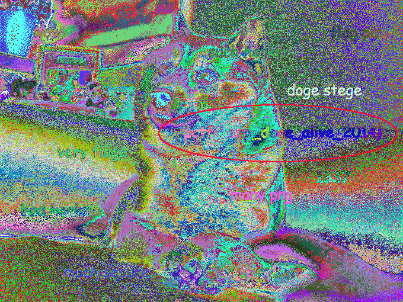

# doge_stege writeup
    Plaid CTF, 2014
    Writeup by pipecork

We start with our original image, a simple doge meme:


`file doge_stege.png` confirms it as a png, and auditing it with `pngcheck -v doge_stege.png` returns no errors. We do learn that the image only contains 256 colors, awfully low for a png.

So let's check for anything hidden in the data itself. `strings doge_stege.png` doesn't return anything meaningful. Using `foremost doge_stege.png` doesn't show any hidden files. At 202KB, that'd be unlikely anyway.

This all leads to the conclusion that the flag can be found in the image itself, likely in the palettes somewhere. So we use a quick python script to count the number of occurences of each color and see if anything stands out:
```bash
$ cat color-occurences.py
#!/usr/bin/python
from PIL import Image

i = Image.open("doge_stege.png")
c = i.getdata()
l = list(c)

a = []
for color in range(0,256):
    a.append(0)
print "Colors: " + str(len(a))

for x in l:
        a[x] += 1

print a
print l[:15]

$ python2 color-occurences.py
Colors: 256
[2361, 197, 155, 3363, 779, 133, 1698, 1017, 565, 491, 1296, 43, 220, 595, 522, 79, 695, 114, 119, 
434, 1410, 129, 932, 1139, 408, 1372, 65, 124, 662, 227, 1535, 114, 2006, 2040, 1433, 1538, 2106, 
140, 1203, 2764, 1526, 152, 191, 976, 154, 137, 4108, 1627, 585, 1845, 1175, 2709, 1432, 2143, 
4173, 901, 2751, 4315, 27, 929, 3340, 5059, 2024, 5774, 1377, 2923, 2555, 3717, 7051, 7568, 1892, 
417, 2068, 1629, 818, 13, 1982, 1775, 2741, 13, 11, 8, 2545, 3790, 5583, 106, 577, 3, 2029, 211, 
5136, 3133, 23, 13, 33, 1819, 6321, 2, 2237, 15, 7987, 6558, 1, 324, 249, 8, 2, 1158, 22, 4831, 
2318, 7016, 312, 225, 972, 3779, 6452, 12000, 4380, 3755, 110, 303, 4424, 5631, 8573, 726, 688, 
1042, 33, 277, 675, 516, 21, 650, 299, 83, 140, 207, 364, 427, 57, 202, 293, 97, 30, 361, 124, 
142, 259, 219, 311, 16, 79, 237, 48, 52, 239, 43, 85, 37, 176, 67, 226, 53, 90, 180, 241, 16, 15, 
8, 58, 32, 28, 127, 8, 18, 85, 4, 32, 30, 72, 7, 21, 16, 5, 6, 30, 12, 1, 11, 6, 16, 12, 1, 3, 3, 
9, 1, 2, 2, 1, 5, 2, 8, 2, 1, 1, 1, 2, 1890, 915, 924, 1369, 697, 4337, 383, 2878, 2785, 553, 1940, 
630, 1080, 1858, 1374, 300, 1030, 2849, 3496, 2920, 6556, 3180, 5985, 1047, 4110, 880, 929, 456, 
1043, 1536, 1002, 2161, 2152, 1327, 264, 1042, 4319, 317, 3286, 2223, 5089, 2944, 751, 3683, 1378, 
2065, 4235]
[23, 14, 10, 7, 6, 6, 6, 6, 6, 10, 6, 6, 6, 6, 6]
```

Well, I don't see anything. So at this point we could nudge it around in GIMP for a few hours hoping we find something. But it'd certainly be a lot easier to use Caesum's [Stegsolve](http://www.caesum.com/handbook/Stegsolve.jar) to check for any anomalies. Quickly paging through some palette options (arrows on the bottom after uploading an image) we can start to make out something using random color maps, circled below in red:



Squinting our eyes and checking some other maps, we can make out the final key as `pctf{keep_doge_alive_2014}`

